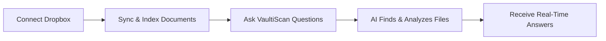

title: VaultiScan Dropbox Connector
sidebar_label: Dropbox Connector

# VaultiScan Dropbox Connector

Connect Your Dropbox. Get Instant AI Answers. No Uploads, No Hassle.

The VaultiScan Dropbox Connector is the easiest way to bring your Dropbox content into VaultiScan’s AI assistant. Skip manual uploads, folder selection, or version tracking—just connect your Dropbox, and VaultiScan handles the rest. Whether the files are yours or shared with you, VaultiScan locates the most relevant documents for every query and keeps them up to date automatically.

## What Is the VaultiScan Dropbox Connector?

The VaultiScan Dropbox Connector links your Dropbox directly to VaultiScan for AI-powered document analysis. Once connected, VaultiScan automatically determines which documents matter for each question—no manual folder selection or uploading required.

### With this connector, you can

- Connect Dropbox instantly using secure OAuth 2.0 authentication.
- Automatically discover relevant files without picking folders
- Stay up to date as edited files are re-indexed in near real time.
- Ask natural questions across your Dropbox and get contextual answers.
- Keep data private with VaultiScan’s enterprise-grade compliance controls.

## Core Capabilities

### Smart Dropbox Connection

- Connect once—VaultiScan manages ongoing sync for your Dropbox content.
- Works with files you own and those shared with you.
- No folder selection; metadata plus content relevance drive discovery.
- Continuous reindexing keeps responses aligned with the latest changes.

### Intelligent AI Search

- Ask VaultiScan anything; it searches, reads, and responds from the most relevant Dropbox documents.
- SSemantic understanding retrieves contextual answers instead of simple keyword matches.
- Optimized to work with advanced large language models for high-quality responses.

### Manual Upload vs. Dropbox Connector

| Feature              | Manual Upload                    | Dropbox Connector Connector                                |
| -------------------- | -------------------------------- | ---------------------------------------------------------- |
| File Selection       | Manually upload individual files | Automatically discovers relevant files via metadata        |
| Updates & Reindexing | Re-upload after every change     | Auto reindexes whenever a document updates                 |
| Sync Frequency       | Manual trigger only              | Real-time background sync                                  |
| Setup Time           | Minutes per upload               | One-time connection in seconds                             |
| Scalability          | Limited by upload size           | Scales to full Dropbox accounts and shared folders folders |
| User Effort          | High                             | Near zero                                                  |

The connector ensures answers always reflect the latest version of every document—no more manual uploads or stale files.

## Enterprise-Grade Security

VaultiScan is built with privacy and compliance at its core:

- OAuth 2.0 authentication — users authenticate directly with Dropbox; no passwords stored.
- End-to-end encryption for all Drive interactions.
- SOC 2 Type II and GDPR-compliant architecture.
- Role-based access controls plus detailed audit logging.

## Real-Time Synchronization

VaultiScan continuously synchronizes Dropbox content:

- Detects and reindexes document changes automatically after edits, renames, or moves.
- Guarantees every answer reflects the newest version.
- Scales across personal folders, shared folders, and team spaces (where permitted).

## Organization-Controlled Dropbox Credentials

Enterprises can supply their own Dropbox OAuth app credentials for maximum control.

**Benefits**

- Full data ownership with org-managed Dropbox app configuration.
- Custom access control over scopes (for example, read-only file access).
- Branded consent screen for user trust.
- Independent rate limits per organization for predictable performance.

VaultiScan supports a step-by-step process for configuring your Dropbox app, setting redirect URIs, defining scopes, and connecting securely.

## How It Works

1. **Connect** – Authenticate securely with Dropbox using OAuth 2.0 and approve the requested permissions.
2. **Sync** – VaultiScan scans and indexes your Dropbox content and keeps it updated over time.
3. **Ask** – Submit questions; VaultiScan identifies and reads the right files automatically.

## Getting Started

1. **Connect Dropbox:** In VaultiScan, go to `Connectors → Dropbox → Connect` and complete the OAuth flow.
2. **Authorize Access:** Grant secure read-only permissions.
3. **Start Asking Questions:** Type a question—VaultiScan automatically locates, reads, and analyzes the relevant files.
4. **Stay Updated:** Modify any file in Dropbox; VaultiScan reindexes it automatically.

### Benefits at a Glance

- No manual uploads or folder selections.
- Always synced with your latest Dropbox content.
- AI answers powered by your private Dropbox data.
- Enterprise-grade privacy and compliance.
- Organization-controlled OAuth setup for governance.

## Next Steps

- **Installation Guide:** Follow the connector setup instructions inside VaultiScan to link Dropbox.
- **Custom OAuth Setup:** Configure your own Dropbox app keys and redirect URIs.
- **Security Overview:** Review VaultiScan’s protection model.
- **Troubleshooting:** Resolve connection or permission issues quickly.

## Need Help?

- **Documentation:** Explore setup and advanced guides.
- **Report Issues:** Submit tickets via GitHub.
- **Support:** Contact the VaultiScan team for assistance.
- **Examples:** See real-world integrations and use cases.

---

The VaultiScan Dropbox Connector bridges your documents and AI—automatically, securely, and intelligently. No more uploads. No more outdated files. Just seamless, always up-to-date insights from your Dropbox every time you ask.
