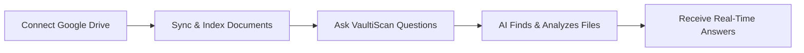

title: VaultiScan Google Drive Connector
sidebar_label: Google Drive Connector

# VaultiScan Google Drive Connector

Connect Your Google Drive. Get Instant AI Answers. No Uploads, No Hassle.

Welcome to the VaultiScan Google Drive Connector - the easiest way to bring your Google Drive content into VaultiScan’s AI assistant. Skip manual uploads, folder selection, or version tracking just connect your Drive, and VaultiScan handles the rest. Whether you own the files or they’re shared with you, VaultiScan locates the most relevant documents for every query and keeps them up to date automatically.

## What Is the VaultiScan Google Drive Connector?

The VaultiScan Google Drive Connector links your Google Drive directly to VaultiScan for AI-powered document analysis. Once connected, VaultiScan automatically determines which documents matter for each question—no manual folder selection or uploading required.

### With this connector, you can

- Connect Google Drive instantly using secure OAuth 2.0 authentication.
- Automatically discover relevant files without picking folders.
- Stay up to date as edited files are re-indexed in real time.
- Ask natural questions across your Drive and get contextual answers.
- Keep data private with VaultiScan’s enterprise-grade compliance controls.

## Core Capabilities

### Smart Drive Connection

- Connect once—VaultiScan manages ongoing sync.
- Works with owned files and shared content.
- No folder selection; metadata plus content relevance drive discovery.
- Real-time reindexing keeps responses current.

### Intelligent AI Search

- Ask VaultiScan anything; it searches, reads, and responds from the most relevant Drive documents.
- Semantic understanding retrieves contextual answers.
- Powered by advanced AI model GPT-4.

### Manual Upload vs. Google Drive Connector

| Feature              | Manual Upload                    | Google Drive Connector                              |
| -------------------- | -------------------------------- | --------------------------------------------------- |
| File Selection       | Manually upload individual files | Automatically discovers relevant files via metadata |
| Updates & Reindexing | Re-upload after every change     | Auto reindexes whenever a document updates          |
| Sync Frequency       | Manual trigger only              | Real-time background sync                           |
| Setup Time           | Minutes per upload               | One-time connection in seconds                      |
| Scalability          | Limited by upload size           | Scales to entire drives and shared folders          |
| User Effort          | High                             | Near zero                                           |

The connector ensures answers always reflect the latest version of every document—no more manual uploads or stale files.

## Enterprise-Grade Security

VaultiScan is built with privacy and compliance at its core:

- OAuth 2.0 authentication — no credentials shared.
- End-to-end encryption for all Drive interactions.
- SOC 2 Type II and GDPR-compliant architecture.
- Role-based access controls plus detailed audit logging.

## Real-Time Synchronization

VaultiScan continuously synchronizes Google Drive content:

- Detects and reindexes document changes automatically.
- Guarantees every answer reflects the newest version.
- Scales across personal, shared, and team drives.

## Organization-Controlled Google Credentials

Enterprises can supply their own Google OAuth Client ID and Secret for maximum control.

**Benefits**

- Full data ownership with org-managed credentials.
- Custom access control over Drive scopes (e.g., read-only).
- Branded consent screen for user trust.
- Independent rate limits per organization for predictable performance.

VaultiScan includes a step-by-step guide for configuring your Google Cloud project, creating OAuth credentials, and connecting securely.

## How It Works

1. **Connect** – Authenticate securely with Google OAuth 2.0.
2. **Sync** – VaultiScan indexes your Drive and keeps it updated.
3. **Ask** – Submit questions; VaultiScan reads the right files and responds instantly.

## Getting Started

1. **Connect Google Drive:** In VaultiScan, go to `Connectors → Google Drive → Connect` and complete the OAuth flow.
2. **Authorize Access:** Grant secure read-only permissions.
3. **Start Asking Questions:** Type a question—VaultiScan automatically locates, reads, and analyzes the relevant files.
4. **Stay Updated:** Modify any file in Drive; VaultiScan reindexes it automatically.

### Benefits at a Glance

- No manual uploads or folder selections.
- Always synced with your latest Drive content.
- AI answers powered by private Google Drive data.
- Enterprise-grade privacy and compliance.
- Organization-controlled OAuth setup for governance.

## Next Steps

- **Installation Guide:** Learn how to connect Google Drive end-to-end.
- **Custom OAuth Setup:** Configure your own Google client secret.
- **Security Overview:** Review VaultiScan’s protection model.
- **Troubleshooting:** Resolve connection or permission issues quickly.

## Need Help?

- **Documentation:** Explore setup and advanced guides.
- **Report Issues:** Submit tickets via GitHub.
- **Support:** Contact the VaultiScan team for assistance.
- **Examples:** See real-world integrations and use cases.

---

The VaultiScan Google Drive Connector bridges your documents and AI—automatically, securely, and intelligently. No more uploads. No more outdated files. Just seamless, always up-to-date insights from your Drive every time you ask.
