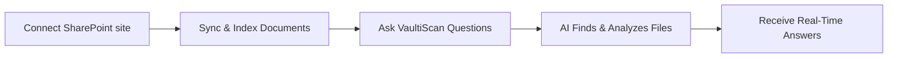

title: VaultiScan SharePoint Connector
sidebar_label: SharePoint Connector

# VaultiScan SharePoint Connector

Connect Your SharePoint Site. Get Instant AI Answers. No Uploads, No Hassle.

Welcome to the VaultiScan SharePoint Connector – the seamless way to integrate your Microsoft SharePoint document libraries into VaultiScan’s AI assistant. No manual uploads, folder selection, or version management required. VaultiScan discovers, indexes, and stays updated with the most relevant SharePoint files to answer your queries effortlessly.

## What Is the VaultiScan SharePoint Connector?

The VaultiScan SharePoint Connector securely links your SharePoint Online content with VaultiScan, enabling AI-powered insights into all your site documents. VaultiScan automatically identifies documents relevant to your questions using metadata and content, without needing manual folder selections or uploads.

### With this connector, you can

- Connect instantly using [OAuth 2.0 and Microsoft Graph API](/connectors/sharepoint/configuration.md).
- Automatically discover and index relevant files within your SharePoint sites.
- Stay in sync as files are edited or updated.
- Query naturally in English and get answers referencing your SharePoint files.
- Keep data secure and compliant with enterprise-grade controls.

## Core Capabilities

### Seamless SharePoint Integration

- One-time OAuth connection, VaultiScan handles continuous syncing.
- Supports files you own and those shared with you.
- No manual folder or library targeting; metadata-driven discovery.
- Real-time or near-real-time indexing for fresh content.

### Intelligent AI Search

- Ask VaultiScan anything; it searches, reads, and responds from the most relevant Drive documents.
- Semantic understanding retrieves contextual answers.
- Powered by advanced AI model GPT-4.

### Manual Upload vs. SharePoint Connector

| Feature              | Manual Upload                    | SharePoint Connector Connector                      |
| -------------------- | -------------------------------- | --------------------------------------------------- |
| File Selection       | Manually upload individual files | Automatically discovers relevant files via metadata |
| Updates & Reindexing | Re-upload after every change     | Auto reindexes whenever a document updates          |
| Sync Frequency       | Manual trigger only              | Real-time background sync                           |
| Setup Time           | Minutes per upload               | One-time connection in seconds                      |
| Scalability          | Limited by upload size           | Scales to entire drives and shared folders          |
| User Effort          | High                             | Near zero                                           |

The connector ensures answers always reflect the latest version of every document—no more manual uploads or stale files.

## Enterprise-Grade Security

VaultiScan is built with privacy and compliance at its core:

- OAuth 2.0 authentication — no credentials shared.
- End-to-end encryption for all SharePoint interactions.
- SOC 2 Type II and GDPR-compliant architecture.
- Role-based access controls plus detailed audit logging.

## Real-Time Synchronization

VaultiScan continuously synchronizes Google Drive content:

- Detects and reindexes document changes automatically.
- Guarantees every answer reflects the newest version.
- Scales across personal, shared, and team sharepoint sites.

## Organization-Controlled SharePoint Credentials

Enterprises can supply their own Azure AD app credentials for SharePoint API access.

**Benefits**

- Full data ownership with org-managed credentials.
- Custom access control over SharePoint scopes (e.g., read-only).
- Independent rate limits per organization for predictable performance.

VaultiScan includes a step-by-step guide for configuring your SharePoint site, creating OAuth credentials, and connecting securely.

## How It Works

1. **Connect** – Authenticate securely with Microsoft OAuth and Graph API.
2. **Sync** – VaultiScan indexes your SharePoint libraries and sites seamlessly.
3. **Ask** – Submit questions; VaultiScan reads the right files and responds instantly.

## Getting Started

1. **Connect SharePoint:** In VaultiScan, go to `Connectors → SharePoint → Connect` and complete the OAuth flow.
2. **Authorize Access:** Grant secure read-only permissions.
3. **Start Asking Questions:** Type a question—VaultiScan automatically locates, reads, and analyzes the relevant files.
4. **Stay Updated:** Modify any file in SharePoint; VaultiScan reindexes it automatically.

### Benefits at a Glance

- No manual uploads or folder selections.
- Always synced with your latest SharePoint document content.
- AI answers powered by private SharePoint site data.
- Enterprise-grade privacy and compliance.
- Organization-controlled OAuth setup for governance.

## Next Steps

- **Installation Guide:** Learn how to connect SharePoint end-to-end.
- **Custom OAuth Setup:** Configure Custom OAuth settings for your tenant.
- **Security Overview:** Review VaultiScan’s protection model.
- **Troubleshooting:** Resolve connection or permission issues quickly.

## Need Help?

- **Documentation:** Explore setup and advanced guides.
- **Report Issues:** Submit tickets via GitHub.
- **Support:** Contact the VaultiScan team for assistance.
- **Examples:** See real-world integrations and use cases.

---

The VaultiScan SharePoint Connector effortlessly bridges your SharePoint documents and AI—automatic, secure, and smart. No uploads, no stale data, just always-ready knowledge at your fingertips.
