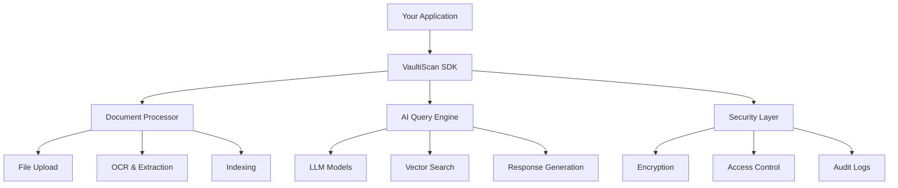

# Embedding SDK Overview

The VaultiScan Embedding SDK enables you to integrate powerful document analysis and AI-powered questioning capabilities directly into your applications.

## What is the Embedding SDK?

The VaultiScan Embedding SDK is a comprehensive toolkit that allows developers to:

- **Upload and Process Documents**: Handle various file formats including PDF, DOCX, TXT, and more
- **AI-Powered Querying**: Ask natural language questions about document content
- **Smart Document Analysis**: Extract insights, summaries, and key information
- **Secure Data Handling**: Enterprise-grade security with encryption and audit logs
- **Multi-Model Support**: Choose from GPT-4, Claude, Gemini, and other leading AI models

## Key Capabilities

### 🔍 **Intelligent Document Search**
Find specific information across thousands of documents instantly using natural language queries.

### 📊 **Smart Summarization**
Generate concise summaries of lengthy documents in seconds.

### 🔒 **Enterprise Security**
Your documents remain private and encrypted, with full audit trails for compliance.

### ⚡ **Real-Time Processing**
Fast document upload and processing with instant query responses.

### 🌐 **Multi-Platform Support**
Available for JavaScript, React, Vue.js, Angular, and other popular frameworks.

## Architecture Overview



## Supported File Types

| Format | Extension | Description |
|--------|-----------|-------------|
| PDF | `.pdf` | Portable Document Format |
| Word | `.docx`, `.doc` | Microsoft Word documents |
| Text | `.txt`, `.md` | Plain text and Markdown |
| Excel | `.xlsx`, `.xls` | Spreadsheets |
| PowerPoint | `.pptx`, `.ppt` | Presentations |
| Images | `.jpg`, `.png` | Image files with OCR |

## AI Models Available

### **GPT-4 / GPT-3.5**
Advanced natural language understanding and generation from OpenAI.

### **Claude 3 (Opus, Sonnet, Haiku)**
Context-aware AI models prioritizing safety and accuracy.

### **Gemini 1.5 / 1.0**
Multi-modal AI combining text and visual understanding.

### **LLaMA 2 / 3**
Open foundation models for versatile language tasks.

### **DeepSeek-Coder**
Specialized AI for code analysis and technical documentation.

## Integration Patterns

### **Client-Side Integration**
Perfect for single-page applications and direct user interactions.

```javascript
import { VaultiScan } from '@vaultiscan/embedding-sdk';

const client = new VaultiScan({
  apiKey: 'your-api-key'
});
```

### **Server-Side Integration**
Ideal for backend services and batch processing.

```javascript
const { VaultiScan } = require('@vaultiscan/embedding-sdk');

const processor = new VaultiScan({
  apiKey: process.env.VAULTISCAN_API_KEY,
  environment: 'production'
});
```

### **Framework Components**
Pre-built components for popular frameworks.

```jsx
import { DocumentUploader, QueryInterface } from '@vaultiscan/react-sdk';

function DocumentManager() {
  return (
    <div>
      <DocumentUploader />
      <QueryInterface />
    </div>
  );
}
```

## Use Cases

### **HR Document Management**
- Employee handbook queries
- Policy clarification
- Onboarding document search

### **Legal Document Analysis**
- Contract clause extraction
- Compliance checking
- Legal precedent research

### **Technical Documentation**
- API reference queries
- Code documentation search
- System specification analysis

### **Knowledge Management**
- Corporate knowledge base
- Training material queries
- Process documentation

## Performance Characteristics

| Metric | Typical Performance |
|--------|-------------------|
| Document Upload | < 5 seconds (10MB file) |
| Text Extraction | < 10 seconds |
| Query Response | < 2 seconds |
| Concurrent Users | 1000+ |
| Document Limit | No limit |

## Security Features

### **Data Encryption**
- TLS 1.3 in transit
- AES-256 at rest
- Zero-knowledge architecture

### **Access Control**
- API key authentication
- Role-based permissions
- IP whitelisting

### **Compliance**
- SOC 2 Type II
- GDPR compliant
- HIPAA available

## Getting Started

1. **[Installation](../getting-started/installation)** - Set up the SDK
2. **[Quick Start](../getting-started/quick-start)** - Your first integration
3. **[Configuration](../getting-started/configuration)** - Customize settings
4. **[Authentication](../getting-started/authentication)** - Secure your app

## Next Steps

Explore specific SDK implementations:
- [JavaScript SDK](./javascript-sdk)
- [React Components](./react-components)
- [Vue.js Components](./vue-components)
- [Angular Components](./angular-components)
